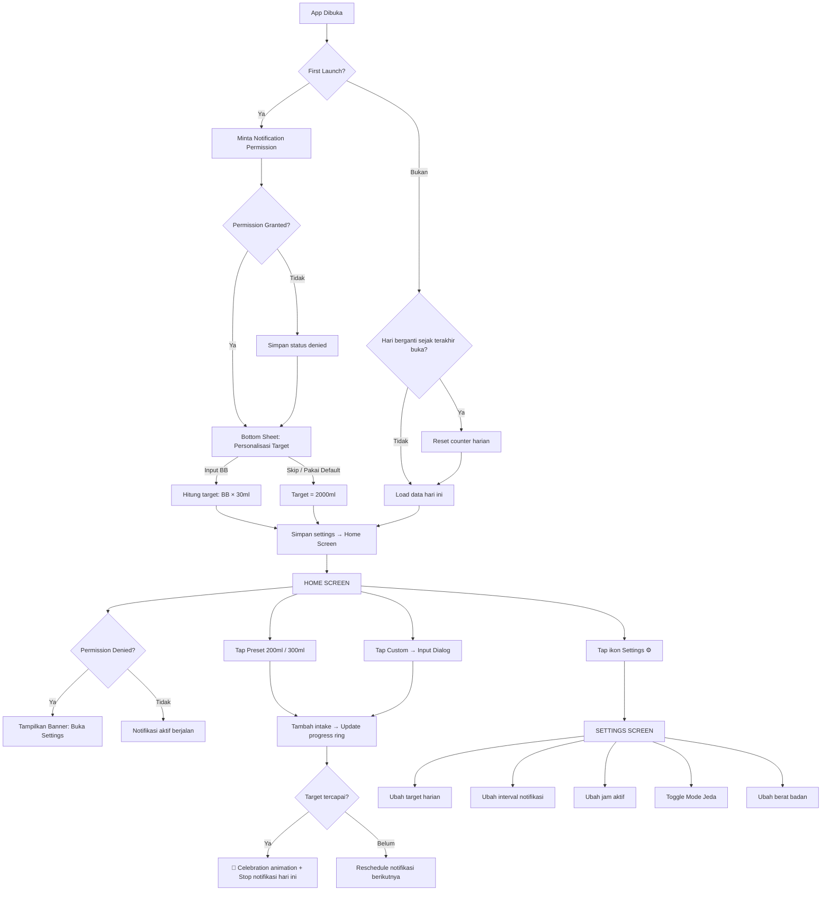
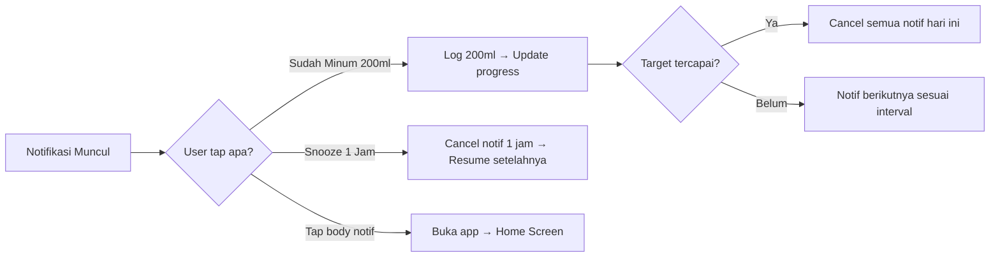
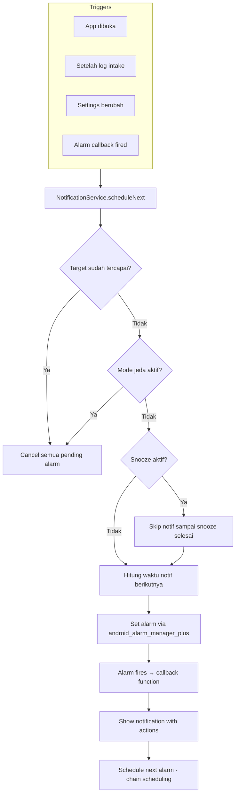

# TDD — Water Reminder App

> Dokumen ini adalah blueprint teknis untuk membangun Water Reminder App.
> Baca bersama dengan [PRD_water-reminder-app.md](./PRD_water-reminder-app.md) untuk konteks fitur dan keputusan produk.

---

## 1. User Flow



### Flow dari Notifikasi (di luar app)



---

## 2. Screen Inventory

### Screen 1: Home Screen (Main)
Ini satu-satunya screen yang user lihat 95% waktu pakai app.

**Layout:**
```
┌──────────────────────────────┐
│  Water Reminder    [⚙️]     │  ← App bar minimal, settings icon kanan
│                              │
│  ┌────────────────────────┐  │
│  │   ╭─────────────────╮  │  │
│  │   │                 │  │  │
│  │   │    600 ml       │  │  │  ← Progress ring (lingkaran)
│  │   │   ──────────    │  │  │     Angka besar di tengah
│  │   │   dari 2000ml   │  │  │     Sub-text target
│  │   │                 │  │  │
│  │   ╰─────────────────╯  │  │
│  └────────────────────────┘  │
│                              │
│  ┌──────────┐ ┌──────────┐  │
│  │  +200ml  │ │  +300ml  │  │  ← Preset buttons (FilledButton.tonal)
│  └──────────┘ └──────────┘  │
│                              │
│  ┌──────────────────────────┐│
│  │     💧 Jumlah Lain      ││  ← Custom input (FilledButton)
│  └──────────────────────────┘│
│                              │
│  [🔕 Mode Jeda: AKTIF]      │  ← Muncul hanya saat jeda aktif
│  [⚠️ Izin notifikasi OFF]   │  ← Muncul hanya saat permission denied
└──────────────────────────────┘
```

**State variants:**
| State | Tampilan |
|-------|----------|
| Normal (progress) | Progress ring terisi sebagian, tombol aktif |
| Target tercapai | Ring penuh + warna hijau + celebration animation (confetti/checkmark) + tombol tetap aktif (user boleh minum lebih) |
| Permission denied | Banner kuning di bawah: "Notifikasi dimatikan. Tap untuk buka Settings" |
| Mode jeda aktif | Chip/banner: "🔕 Mode Jeda aktif — tap untuk resume" |
| Baru reset (pagi) | Ring kosong, counter 0ml |

### Screen 2: Settings Screen
Satu halaman scrollable berisi semua pengaturan.

**Layout:**
```
┌──────────────────────────────┐
│  ← Settings                  │
│                              │
│  ── Target Harian ────────  │
│  Target (ml)        [2000]  │  ← Number input / slider
│  Berat badan (kg)   [  60]  │  ← Optional, auto-hitung target
│  Kalkulasi otomatis  [ ON]  │  ← Toggle: BB × 30ml
│                              │
│  ── Notifikasi ───────────  │
│  Interval           [30m ▼] │  ← Dropdown: 15/30/45/60 menit
│  Jam mulai          [07:00] │  ← Time picker
│  Jam selesai        [22:00] │  ← Time picker
│  Mode Jeda          [ OFF]  │  ← Toggle + info "stop semua notif"
│                              │
│  ── Preset Tombol ────────  │
│  Tombol 1 (ml)       [200]  │  ← User bisa custom preset
│  Tombol 2 (ml)       [300]  │  ← User bisa custom preset
│                              │
│  ── Tentang ──────────────  │
│  Versi              v1.0.0  │
│  Reset data hari ini  [🔄]  │  ← Emergency reset
└──────────────────────────────┘
```

### Screen 3: Custom Input Dialog (Modal)
Bukan screen terpisah — muncul sebagai dialog/bottom sheet di atas Home Screen.

```
┌──────────────────────────────┐
│       Minum berapa ml?       │
│                              │
│    ┌──────────────────┐      │
│    │      350         │ ml   │  ← Number input + keyboard numerik
│    └──────────────────┘      │
│                              │
│  [100] [150] [250] [500]     │  ← Quick pick chips (opsional)
│                              │
│  [ Batal ]     [ Simpan 💧] │
└──────────────────────────────┘
```

### Screen 4: Onboarding Bottom Sheet (First Launch Only)
Muncul sekali saat pertama kali buka app, setelah notification permission dialog.

```
┌──────────────────────────────┐
│  💧 Selamat datang!          │
│                              │
│  Mau atur target minum       │
│  berdasarkan berat badan?    │
│                              │
│  Berat badan:                │
│  ┌──────────────────┐        │
│  │      60          │ kg     │
│  └──────────────────┘        │
│  Target: 1800ml/hari         │  ← Live preview kalkulasi
│                              │
│  [Pakai Default 2L]          │  ← Secondary action
│  [Pakai Target Ini  ✓]       │  ← Primary action
└──────────────────────────────┘
```

---

## 3. Arsitektur & Folder Structure

### Pattern: Clean Architecture + BLoC/Cubit

```
lib/
├── main.dart                        # Entry point, DI init, runApp
├── app.dart                         # MaterialApp, theme, GoRouter setup
│
├── core/                            # Shared/common code
│   ├── constants/
│   │   └── app_constants.dart       # Default values, channel IDs, keys
│   ├── theme/
│   │   ├── app_theme.dart           # ThemeData (light/dark + dynamic color)
│   │   ├── app_colors.dart          # Color definitions (seed colors, custom)
│   │   └── app_typography.dart      # TextTheme definitions
│   ├── utils/
│   │   ├── helpers.dart             # Format ml, time helpers, kalkulasi BB
│   │   └── extensions.dart          # Dart extensions (DateTime, String, etc)
│   ├── router/
│   │   └── app_router.dart          # GoRouter route definitions
│   └── di/
│       └── injection.dart           # get_it + injectable configuration
│       └── injection.config.dart    # Auto-generated by injectable
│
├── data/                            # Data layer
│   ├── models/
│   │   ├── intake_entry.dart        # Hive model: per-drink log
│   │   ├── daily_summary.dart       # Hive model: daily aggregation
│   │   └── user_settings.dart       # Model: user preferences
│   ├── datasources/
│   │   ├── intake_local_datasource.dart   # Hive CRUD for intake
│   │   └── settings_local_datasource.dart # SharedPreferences wrapper
│   └── repositories/
│       ├── intake_repository_impl.dart    # IntakeRepository implementation
│       └── settings_repository_impl.dart  # SettingsRepository implementation
│
├── domain/                          # Domain/business layer
│   ├── repositories/                # Abstract repository interfaces
│   │   ├── intake_repository.dart
│   │   └── settings_repository.dart
│   └── usecases/
│       ├── add_intake.dart
│       ├── get_today_intake.dart
│       ├── reset_daily.dart
│       └── schedule_notification.dart
│
├── presentation/                    # UI layer
│   ├── home/
│   │   ├── bloc/
│   │   │   ├── home_cubit.dart      # Cubit: state + business actions
│   │   │   └── home_state.dart      # Immutable state (freezed/Equatable)
│   │   ├── widgets/
│   │   │   ├── progress_ring.dart
│   │   │   ├── preset_button.dart
│   │   │   ├── custom_input_dialog.dart
│   │   │   ├── permission_banner.dart
│   │   │   ├── pause_banner.dart
│   │   │   └── celebration_overlay.dart
│   │   └── home_screen.dart
│   ├── settings/
│   │   ├── bloc/
│   │   │   ├── settings_cubit.dart
│   │   │   └── settings_state.dart
│   │   └── settings_screen.dart
│   └── onboarding/
│       └── onboarding_sheet.dart
│
└── services/                        # Background services
    ├── notification_service.dart     # Schedule, cancel, reschedule
    ├── alarm_service.dart           # android_alarm_manager_plus wrapper
    └── midnight_reset_service.dart  # workmanager callback for daily reset

test/
├── bloc/
│   ├── home_cubit_test.dart
│   └── settings_cubit_test.dart
├── repositories/
│   ├── intake_repository_test.dart
│   └── settings_repository_test.dart
├── services/
│   └── notification_service_test.dart
└── widgets/
    ├── home_screen_test.dart
    └── progress_ring_test.dart
```

---

## 4. State Management: BLoC/Cubit

**Alasan pilih BLoC/Cubit:**
- **Separation of concerns** yang jelas: Cubit handle logic, Widget handle UI
- **Testable** — `bloc_test` membuat testing state transitions sangat mudah
- **Predictable** — immutable state, unidirectional data flow
- **Scalable** — bisa upgrade dari Cubit ke full BLoC jika dibutuhkan

### Cubit yang Dibutuhkan

#### `HomeCubit`
```dart
class HomeCubit extends Cubit<HomeState> {
  final AddIntake _addIntake;
  final GetTodayIntake _getTodayIntake;
  final ResetDaily _resetDaily;
  final ScheduleNotification _scheduleNotification;
  final SettingsRepository _settingsRepository;

  HomeCubit({
    required AddIntake addIntake,
    required GetTodayIntake getTodayIntake,
    required ResetDaily resetDaily,
    required ScheduleNotification scheduleNotification,
    required SettingsRepository settingsRepository,
  })  : _addIntake = addIntake,
        _getTodayIntake = getTodayIntake,
        _resetDaily = resetDaily,
        _scheduleNotification = scheduleNotification,
        _settingsRepository = settingsRepository,
        super(const HomeState());

  Future<void> loadToday() async { /* Load today's data */ }
  Future<void> addIntake(int ml) async { /* Add intake, update, reschedule */ }
  Future<void> resetDaily() async { /* Reset counter */ }
}
```

#### `HomeState`
```dart
class HomeState extends Equatable {
  final int todayIntakeMl;
  final int targetMl;
  final List<IntakeEntry> entries;
  final bool targetReached;
  final double progressPercent;
  final int remainingMl;
  final bool isPauseMode;
  final bool isPermissionGranted;
  final bool isFirstLaunch;
  final int preset1Ml;
  final int preset2Ml;

  const HomeState({
    this.todayIntakeMl = 0,
    this.targetMl = 2000,
    this.entries = const [],
    this.targetReached = false,
    this.progressPercent = 0.0,
    this.remainingMl = 2000,
    this.isPauseMode = false,
    this.isPermissionGranted = false,
    this.isFirstLaunch = true,
    this.preset1Ml = 200,
    this.preset2Ml = 300,
  });

  HomeState copyWith({...}) => HomeState(...);

  @override
  List<Object?> get props => [...];
}
```

#### `SettingsCubit`
```dart
class SettingsCubit extends Cubit<SettingsState> {
  final SettingsRepository _settingsRepository;
  final NotificationService _notificationService;

  SettingsCubit({
    required SettingsRepository settingsRepository,
    required NotificationService notificationService,
  })  : _settingsRepository = settingsRepository,
        _notificationService = notificationService,
        super(const SettingsState());

  Future<void> loadSettings() async { /* Load from repository */ }
  Future<void> updateTarget(int ml) async { /* Update + reschedule */ }
  Future<void> updateInterval(int minutes) async { /* Update + reschedule */ }
  Future<void> togglePause() async { /* Toggle pause mode */ }
  Future<void> setBodyWeight(double kg) async { /* Set weight + auto-calc */ }
  Future<void> updateActiveHours(...) async { /* Update active hours */ }
}
```

#### `SettingsState`
```dart
class SettingsState extends Equatable {
  final int targetMl;
  final int intervalMinutes;
  final int activeStartHour;
  final int activeStartMinute;
  final int activeEndHour;
  final int activeEndMinute;
  final bool pauseMode;
  final double? bodyWeightKg;
  final bool autoCalcTarget;
  final int preset1Ml;
  final int preset2Ml;

  const SettingsState({
    this.targetMl = 2000,
    this.intervalMinutes = 30,
    this.activeStartHour = 7,
    this.activeStartMinute = 0,
    this.activeEndHour = 22,
    this.activeEndMinute = 0,
    this.pauseMode = false,
    this.bodyWeightKg,
    this.autoCalcTarget = false,
    this.preset1Ml = 200,
    this.preset2Ml = 300,
  });

  SettingsState copyWith({...}) => SettingsState(...);

  @override
  List<Object?> get props => [...];
}
```

### Widget Integration
```dart
// In home_screen.dart:
class HomeScreen extends StatelessWidget {
  const HomeScreen({super.key});

  @override
  Widget build(BuildContext context) {
    return BlocProvider(
      create: (context) => getIt<HomeCubit>()..loadToday(),
      child: BlocBuilder<HomeCubit, HomeState>(
        builder: (context, state) {
          // UI reads from state, calls context.read<HomeCubit>().addIntake()
          return Scaffold(...);
        },
      ),
    );
  }
}
```

---

## 5. Data Model

### `IntakeEntry` (Hive Model)
```dart
import 'package:hive/hive.dart';

part 'intake_entry.g.dart';

@HiveType(typeId: 0)
class IntakeEntry extends HiveObject {
  @HiveField(0)
  final String id;             // UUID

  @HiveField(1)
  final String date;           // Format: "yyyy-MM-dd"

  @HiveField(2)
  final DateTime timestamp;   // Full datetime

  @HiveField(3)
  final int amountMl;         // Jumlah ml yang diminum

  IntakeEntry({
    required this.id,
    required this.date,
    required this.timestamp,
    required this.amountMl,
  });
}
```

### `DailySummary` (Hive Model)
```dart
@HiveType(typeId: 1)
class DailySummary extends HiveObject {
  @HiveField(0)
  final String date;           // Format: "yyyy-MM-dd", juga sebagai key

  @HiveField(1)
  final int totalMl;

  @HiveField(2)
  final int targetMl;          // Snapshot target hari itu

  @HiveField(3)
  final bool targetReached;

  DailySummary({
    required this.date,
    this.totalMl = 0,
    required this.targetMl,
    this.targetReached = false,
  });
}
```

### `UserSettings` (shared_preferences data class)
```dart
class UserSettings {
  final int targetMl;
  final int intervalMinutes;
  final int activeStartHour;
  final int activeStartMinute;
  final int activeEndHour;
  final int activeEndMinute;
  final bool pauseMode;
  final int? snoozeUntilEpoch;       // epoch millis, null = tidak snooze
  final double? bodyWeightKg;        // null = belum diisi
  final bool autoCalcTarget;
  final int preset1Ml;
  final int preset2Ml;
  final bool isFirstLaunch;
  final bool notifPermissionGranted;

  const UserSettings({
    this.targetMl = 2000,
    this.intervalMinutes = 30,
    this.activeStartHour = 7,
    this.activeStartMinute = 0,
    this.activeEndHour = 22,
    this.activeEndMinute = 0,
    this.pauseMode = false,
    this.snoozeUntilEpoch,
    this.bodyWeightKg,
    this.autoCalcTarget = false,
    this.preset1Ml = 200,
    this.preset2Ml = 300,
    this.isFirstLaunch = true,
    this.notifPermissionGranted = false,
  });

  UserSettings copyWith({...}) => UserSettings(...);
}
```

---

## 6. Local Storage

### SharedPreferences — untuk User Settings
Lightweight key-value storage untuk settings sederhana.

```dart
// settings_local_datasource.dart
class SettingsLocalDatasource {
  final SharedPreferences _prefs;

  SettingsLocalDatasource(this._prefs);

  // Keys
  static const _kTargetMl = 'target_ml';
  static const _kIntervalMinutes = 'interval_minutes';
  static const _kActiveStartHour = 'active_start_hour';
  static const _kActiveStartMinute = 'active_start_minute';
  static const _kActiveEndHour = 'active_end_hour';
  static const _kActiveEndMinute = 'active_end_minute';
  static const _kPauseMode = 'pause_mode';
  static const _kSnoozeUntil = 'snooze_until';
  static const _kBodyWeightKg = 'body_weight_kg';
  static const _kAutoCalcTarget = 'auto_calc_target';
  static const _kPreset1Ml = 'preset_1_ml';
  static const _kPreset2Ml = 'preset_2_ml';
  static const _kIsFirstLaunch = 'is_first_launch';
  static const _kNotifPermissionGranted = 'notif_permission_granted';

  UserSettings getSettings() {
    return UserSettings(
      targetMl: _prefs.getInt(_kTargetMl) ?? 2000,
      intervalMinutes: _prefs.getInt(_kIntervalMinutes) ?? 30,
      // ... map all keys
    );
  }

  Future<void> updateTargetMl(int ml) async {
    await _prefs.setInt(_kTargetMl, ml);
  }

  // ... other update functions
}
```

### Hive — untuk Intake Log
Butuh query historis (% hari target, retention), dan performa lebih baik dari sqflite untuk Flutter.

```dart
// intake_local_datasource.dart
class IntakeLocalDatasource {
  static const _intakeBoxName = 'intake_entries';
  static const _summaryBoxName = 'daily_summaries';

  late Box<IntakeEntry> _intakeBox;
  late Box<DailySummary> _summaryBox;

  Future<void> init() async {
    _intakeBox = await Hive.openBox<IntakeEntry>(_intakeBoxName);
    _summaryBox = await Hive.openBox<DailySummary>(_summaryBoxName);
  }

  Future<void> addEntry(IntakeEntry entry) async {
    await _intakeBox.add(entry);
  }

  List<IntakeEntry> getEntriesByDate(String date) {
    return _intakeBox.values
        .where((entry) => entry.date == date)
        .toList()
      ..sort((a, b) => b.timestamp.compareTo(a.timestamp));
  }

  int getTotalMlByDate(String date) {
    return _intakeBox.values
        .where((entry) => entry.date == date)
        .fold(0, (sum, entry) => sum + entry.amountMl);
  }

  Future<void> deleteByDate(String date) async {
    final keysToDelete = _intakeBox.keys.where((key) {
      final entry = _intakeBox.get(key);
      return entry?.date == date;
    }).toList();
    await _intakeBox.deleteAll(keysToDelete);
  }

  // === Daily Summary ===
  Future<void> upsertSummary(DailySummary summary) async {
    await _summaryBox.put(summary.date, summary);
  }

  DailySummary? getSummaryByDate(String date) {
    return _summaryBox.get(date);
  }

  int getTargetReachedCount() {
    return _summaryBox.values.where((s) => s.targetReached).length;
  }

  int getTotalDays() {
    return _summaryBox.length;
  }
}
```

**Kenapa 2 box (Hive)?**
- `intake_entries` = log detail per-minum (bisa dipakai di v2 untuk timeline/grafik)
- `daily_summaries` = ringkasan harian, cepat di-query untuk metrik (% hari tercapai, retention D7)

---

## 7. Notification System

### Architecture Overview



### Notification Channel Setup
```dart
// notification_service.dart
import 'package:flutter_local_notifications/flutter_local_notifications.dart';

class NotificationService {
  final FlutterLocalNotificationsPlugin _plugin =
      FlutterLocalNotificationsPlugin();

  static const _channelId = 'water_reminder_channel';
  static const _channelName = 'Pengingat Minum Air';
  static const _channelDesc =
      'Notifikasi pengingat untuk minum air secara rutin';

  Future<void> init() async {
    const androidSettings =
        AndroidInitializationSettings('@mipmap/ic_launcher');
    const iosSettings = DarwinInitializationSettings(
      requestAlertPermission: false,  // Diminta manual via permission_handler
      requestBadgePermission: false,
      requestSoundPermission: false,
    );
    const settings = InitializationSettings(
      android: androidSettings,
      iOS: iosSettings,
    );

    await _plugin.initialize(
      settings,
      onDidReceiveNotificationResponse: _onNotificationTapped,
    );

    // Create Android notification channel
    const androidChannel = AndroidNotificationChannel(
      _channelId,
      _channelName,
      description: _channelDesc,
      importance: Importance.high,
      enableVibration: true,
    );

    await _plugin
        .resolvePlatformSpecificImplementation<
            AndroidFlutterLocalNotificationsPlugin>()
        ?.createNotificationChannel(androidChannel);
  }

  void _onNotificationTapped(NotificationResponse response) {
    // Handle notification tap — navigate to home screen
  }
}
```

### AlarmManager Scheduling (Android)
```dart
// alarm_service.dart
import 'package:android_alarm_manager_plus/android_alarm_manager_plus.dart';

class AlarmService {
  static const _alarmId = 0;

  Future<void> init() async {
    await AndroidAlarmManager.initialize();
  }

  Future<void> scheduleNextAlarm(DateTime triggerAt) async {
    await AndroidAlarmManager.cancel(_alarmId);
    await AndroidAlarmManager.oneShotAt(
      triggerAt,
      _alarmId,
      _alarmCallback,
      exact: true,
      wakeup: true,
      allowWhileIdle: true,
      rescheduleOnReboot: true,
    );
  }

  Future<void> cancelAlarm() async {
    await AndroidAlarmManager.cancel(_alarmId);
  }

  @pragma('vm:entry-point')
  static Future<void> _alarmCallback() async {
    // This runs in an isolate — re-init dependencies
    // 1. Show notification
    // 2. Schedule next alarm (chain scheduling)
  }
}
```

### Scheduling Logic (Pseudocode)
```
function scheduleNext():
    cancelPendingAlarm()

    if targetReached OR pauseMode:
        return

    now = DateTime.now()
    activeStart = today at settings.activeStartHour:activeStartMinute
    activeEnd = today at settings.activeEndHour:activeEndMinute

    if now > activeEnd:
        // Hari ini sudah lewat jam aktif → schedule untuk besok
        nextAlarm = tomorrow at activeStart
    else if now < activeStart:
        nextAlarm = today at activeStart
    else:
        nextAlarm = now + interval

    if snoozeUntil != null AND snoozeUntil > nextAlarm:
        nextAlarm = snoozeUntil

    scheduleNextAlarm(nextAlarm)
```

### Notification Action Handling
```dart
// notification_service.dart (continued)
Future<void> showReminderNotification(int remainingMl) async {
  const androidDetails = AndroidNotificationDetails(
    _channelId,
    _channelName,
    channelDescription: _channelDesc,
    importance: Importance.high,
    priority: Priority.high,
    actions: [
      AndroidNotificationAction(
        'drink_200',
        'Sudah Minum (200ml)',
        showsUserInterface: false,
      ),
      AndroidNotificationAction(
        'snooze_60',
        'Snooze 1 Jam',
        showsUserInterface: false,
      ),
    ],
  );

  const iosDetails = DarwinNotificationDetails(
    presentAlert: true,
    presentBadge: true,
    presentSound: true,
  );

  const details = NotificationDetails(
    android: androidDetails,
    iOS: iosDetails,
  );

  await _plugin.show(
    0,
    '💧 Waktunya minum air!',
    '${remainingMl}ml lagi menuju target harianmu',
    details,
  );
}
```

### Notification Action Response
```dart
// Handle action buttons from notification
void _onNotificationActionTapped(NotificationResponse response) {
  switch (response.actionId) {
    case 'drink_200':
      // Log 200ml intake
      // Check if target reached → cancel all or schedule next
      break;
    case 'snooze_60':
      // Set snooze until now + 1 hour
      // Reschedule next alarm
      break;
    default:
      // Tap on notification body → open app
      break;
  }
}
```

---

## 8. Background Tasks

### Midnight Reset (workmanager)
```dart
// midnight_reset_service.dart
import 'package:workmanager/workmanager.dart';

class MidnightResetService {
  static const _taskName = 'midnight_reset';

  Future<void> init() async {
    await Workmanager().initialize(callbackDispatcher, isInDebugMode: false);
  }

  Future<void> scheduleMidnightReset() async {
    final now = DateTime.now();
    final midnight = DateTime(now.year, now.month, now.day + 1); // 00:00 tomorrow
    final delay = midnight.difference(now);

    await Workmanager().registerPeriodicTask(
      _taskName,
      _taskName,
      frequency: const Duration(hours: 24),
      initialDelay: delay,
      constraints: Constraints(
        networkType: NetworkType.not_required,
        requiresBatteryNotLow: false,
        requiresDeviceIdle: false,
      ),
      existingWorkPolicy: ExistingWorkPolicy.keep,
    );
  }
}

@pragma('vm:entry-point')
void callbackDispatcher() {
  Workmanager().executeTask((taskName, inputData) async {
    if (taskName == MidnightResetService._taskName) {
      // Re-init Hive & dependencies in this isolate
      await Hive.initFlutter();

      final today = DateTime.now().toIso8601String().substring(0, 10);
      // Save yesterday's summary
      // Reset today's intake
      // Reschedule notifications for new day

      return true;
    }
    return false;
  });
}
```

### Fallback: Cek saat app dibuka
```dart
// In HomeCubit.loadToday():
Future<void> loadToday() async {
  final today = DateTime.now().toIso8601String().substring(0, 10);
  final settings = await _settingsRepository.getSettings();
  final lastDate = settings.lastActiveDate;

  if (today != lastDate) {
    // Background task belum jalan — reset sekarang
    await _resetDaily(lastDate);
    await _settingsRepository.updateLastActiveDate(today);
  }

  // Load today's data
  final totalMl = await _getTodayIntake(today);
  final entries = await _getTodayEntries(today);
  // Update state via emit(...)
}
```

---

## 9. Dependencies

### pubspec.yaml
```yaml
name: water_reminder
description: Water Reminder App — pengingat minum air harian
publish_to: 'none'
version: 1.0.0+1

environment:
  sdk: '>=3.2.0 <4.0.0'

dependencies:
  flutter:
    sdk: flutter

  # State Management
  flutter_bloc: ^8.1.0
  equatable: ^2.0.0

  # Dependency Injection
  get_it: ^7.6.0
  injectable: ^2.3.0

  # Navigation
  go_router: ^14.0.0

  # Local Storage
  hive: ^4.0.0
  hive_flutter: ^1.1.0
  shared_preferences: ^2.2.0

  # Notifications & Background
  flutter_local_notifications: ^17.0.0
  android_alarm_manager_plus: ^4.0.0
  workmanager: ^0.5.0
  permission_handler: ^11.0.0

  # UI
  dynamic_color: ^1.7.0

  # Utils
  intl: ^0.19.0
  freezed_annotation: ^2.4.0
  uuid: ^4.2.0

dev_dependencies:
  flutter_test:
    sdk: flutter

  # Code Generation
  build_runner: ^2.4.0
  freezed: ^2.4.0
  injectable_generator: ^2.4.0
  hive_generator: ^2.0.0

  # Testing
  bloc_test: ^9.1.0
  mocktail: ^1.0.0

  # Linting
  flutter_lints: ^4.0.0
```

---

## 10. Theming (Material 3 + Flutter)

```dart
// core/theme/app_theme.dart
import 'package:dynamic_color/dynamic_color.dart';
import 'package:flutter/material.dart';

class AppTheme {
  // Seed color fallback (biru air)
  static const _seedColor = Color(0xFF2196F3);

  static ThemeData lightTheme([ColorScheme? dynamicScheme]) {
    final colorScheme = dynamicScheme ??
        ColorScheme.fromSeed(
          seedColor: _seedColor,
          brightness: Brightness.light,
        );

    return ThemeData(
      useMaterial3: true,
      colorScheme: colorScheme,
      textTheme: AppTypography.textTheme,
    );
  }

  static ThemeData darkTheme([ColorScheme? dynamicScheme]) {
    final colorScheme = dynamicScheme ??
        ColorScheme.fromSeed(
          seedColor: _seedColor,
          brightness: Brightness.dark,
        );

    return ThemeData(
      useMaterial3: true,
      colorScheme: colorScheme,
      textTheme: AppTypography.textTheme,
    );
  }
}
```

```dart
// app.dart
class WaterReminderApp extends StatelessWidget {
  const WaterReminderApp({super.key});

  @override
  Widget build(BuildContext context) {
    return DynamicColorBuilder(
      builder: (ColorScheme? lightDynamic, ColorScheme? darkDynamic) {
        return MaterialApp.router(
          title: 'Water Reminder',
          theme: AppTheme.lightTheme(lightDynamic),
          darkTheme: AppTheme.darkTheme(darkDynamic),
          themeMode: ThemeMode.system,
          routerConfig: appRouter,
        );
      },
    );
  }
}
```

> Android 12+ (API 31) otomatis ambil warna dari wallpaper user lewat `dynamic_color`. Untuk device lebih lama dan iOS, fallback ke seed color biru air.

---

## 11. Navigation

App ini sangat simpel — cukup 2 route:

```dart
// core/router/app_router.dart
import 'package:go_router/go_router.dart';

final appRouter = GoRouter(
  initialLocation: '/',
  routes: [
    GoRoute(
      path: '/',
      name: 'home',
      builder: (context, state) => const HomeScreen(),
    ),
    GoRoute(
      path: '/settings',
      name: 'settings',
      builder: (context, state) => const SettingsScreen(),
    ),
  ],
);
```

| Route | Screen | Navigasi |
|-------|--------|----------|
| `/` | `HomeScreen` | Default, selalu ditampilkan |
| `/settings` | `SettingsScreen` | Push dari icon ⚙️ di AppBar |

Dialog (custom input, onboarding) menggunakan `showModalBottomSheet` — bukan route terpisah.

---

## 12. Implementation Order

Urutan build yang direkomendasikan untuk agent. Setiap phase harus bisa di-build & dijalankan tanpa error sebelum lanjut ke phase berikutnya.

### Phase 1: Foundation
```
1. Create Flutter project (flutter create)
2. Setup folder structure sesuai section 3
3. Setup get_it + injectable (DI)
4. Setup theme (app_theme.dart, app_colors.dart, app_typography.dart)
5. Setup main.dart + app.dart + GoRouter
6. Buat data model classes (IntakeEntry, DailySummary, UserSettings)
```
**Checkpoint:** App bisa dijalankan, tampil layar kosong dengan theme Material 3.

### Phase 2: Home Screen UI (Static)
```
7. Buat ProgressRing widget (animated circular progress via CustomPainter)
8. Buat PresetButton widget
9. Buat HomeScreen widget (compose semua widget)
10. Buat CustomInputDialog widget (bottom sheet)
```
**Checkpoint:** Home screen tampil dengan progress ring, tombol preset, tombol custom. Tap tombol menampilkan dialog. Belum ada data nyata.

### Phase 3: Data Layer
```
11. Setup Hive (init, register adapters)
12. Setup SharedPreferences (SettingsLocalDatasource)
13. Buat IntakeLocalDatasource + IntakeRepositoryImpl
14. Buat SettingsLocalDatasource + SettingsRepositoryImpl
15. Buat HomeCubit + HomeState
16. Buat SettingsCubit + SettingsState
17. Wire Cubits ke UI (progress ring bergerak saat tap tombol)
```
**Checkpoint:** Tap tombol → progress ring update → data tersimpan di Hive. Tutup & buka app → data masih ada.

### Phase 4: Settings Screen
```
18. Buat SettingsScreen widget (semua input fields)
19. Connect settings ke SettingsCubit
20. Buat OnboardingSheet widget (first launch)
21. Implement first launch flow (permission → onboarding → home)
```
**Checkpoint:** Settings bisa diubah dan tersimpan. First launch menampilkan onboarding. Perubahan settings langsung terasa di home screen.

### Phase 5: Notification System
```
22. Setup NotificationService (init, channel, permission)
23. Implement AlarmService + scheduleNext() logic
24. Implement notification action handling (drink_200, snooze_60)
25. Implement PermissionBanner widget
26. Implement PauseBanner widget
27. Implement snooze logic
```
**Checkpoint:** Notifikasi muncul sesuai interval. Tap "Sudah Minum" dari notifikasi → log 200ml. Snooze berfungsi. Mode jeda berfungsi.

### Phase 6: Background Tasks & Edge Cases
```
28. Setup MidnightResetService (workmanager)
29. Implement rescheduleOnReboot (android_alarm_manager_plus handles this)
30. Implement midnight reset (background + fallback saat app dibuka)
31. Handle target tercapai → celebration + stop notif
32. Buat CelebrationOverlay widget
33. Handle timezone / date change edge cases
```
**Checkpoint:** App di-close → notifikasi tetap jalan. Lewat tengah malam → counter reset. Target tercapai → celebrasi. Device reboot → alarm dijadwalkan ulang.

### Phase 7: Polish & Testing
```
34. flutter analyze — fix semua lint warnings
35. Unit test untuk HomeCubit & SettingsCubit (bloc_test)
36. Unit test untuk NotificationService scheduling logic
37. Widget test dengan flutter_test
38. Manual testing di Android & iOS
39. Performance check (startup time, memory)
```
**Checkpoint:** Semua test pass. Build bersih tanpa warning. Siap untuk release `v0.1.0-beta`.

---

## 13. Known Limitations (v1)

| Limitation | Penjelasan | Solusi di v2? |
|------------|-----------|---------------|
| iOS background limitations | iOS lebih restriktif untuk background tasks dibanding Android | Optimasi dengan `BGTaskScheduler` via plugin |
| OEM battery optimization | Beberapa OEM (Xiaomi, Huawei, Samsung) agresif kill background process | Tambah panduan user + detect OEM, guide ke battery optimization settings |
| Gak ada grafik historis | User gak bisa lihat tren mingguan/bulanan | v2: tambah screen statistik dari data `daily_summaries` |
| Single device | Data gak sync antar device | v2: cloud backup (Firebase/Supabase) kalau perlu |
| No widget | Gak ada home screen widget untuk quick log | v2: pakai `home_widget` package (Flutter) |

---

## 14. Platform Configuration

### Android — `android/app/src/main/AndroidManifest.xml`
```xml
<manifest xmlns:android="http://schemas.android.com/apk/res/android">

    <!-- Permissions -->
    <uses-permission android:name="android.permission.POST_NOTIFICATIONS" />
    <uses-permission android:name="android.permission.RECEIVE_BOOT_COMPLETED" />
    <uses-permission android:name="android.permission.SCHEDULE_EXACT_ALARM" />
    <uses-permission android:name="android.permission.USE_EXACT_ALARM" />
    <uses-permission android:name="android.permission.WAKE_LOCK" />
    <uses-permission android:name="android.permission.VIBRATE" />

    <application ...>

        <!-- AlarmManager BroadcastReceiver (android_alarm_manager_plus) -->
        <!-- Plugin handles receiver registration automatically -->

        <!-- Boot Receiver for rescheduling alarms -->
        <!-- Handled by android_alarm_manager_plus with rescheduleOnReboot: true -->

    </application>
</manifest>
```

### iOS — `ios/Runner/Info.plist`
```xml
<!-- Notification permissions -->
<key>UIBackgroundModes</key>
<array>
    <string>fetch</string>
    <string>processing</string>
</array>
```
